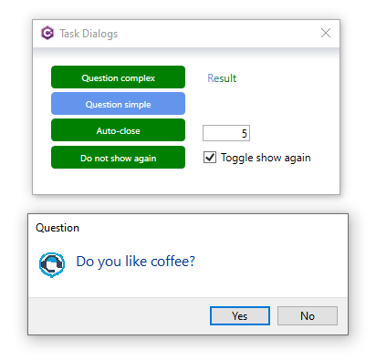
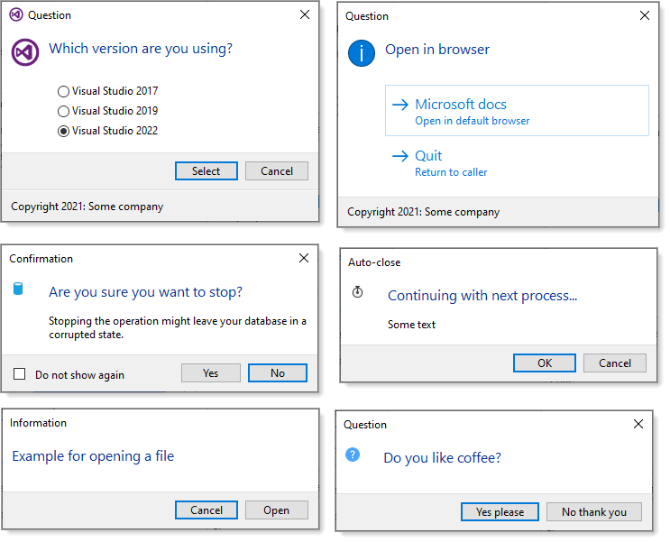
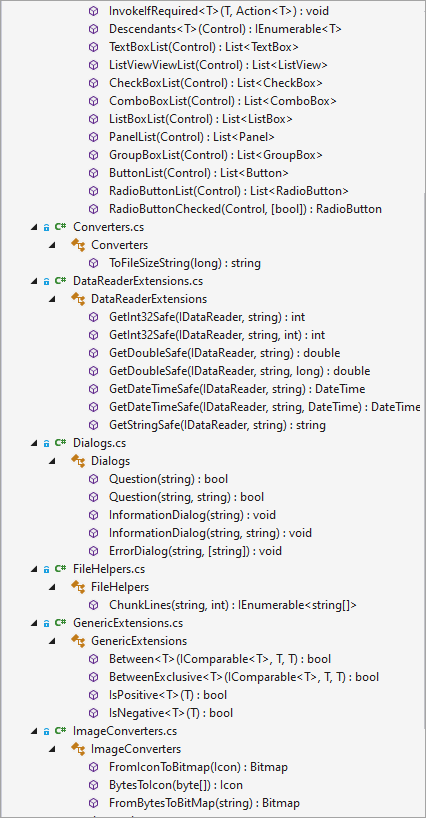

# About

This repository is for providing ideas for how a developer writing for windows forms might create a class project with custom controls that may be needed from time to time when the standard controls don’t fit specific needs.

For a list of controls and descriptions see the [following page](https://github.com/karenpayneoregon/team-controls/blob/master/TeamControls/readme.md).

## Note

Each control has the following properties

| Property | Description | 
| :---         | :---      |
| Id  | An int to identify the control     |
| HasId     | Indicates if the control has an `Id`        |
| Stash     | A string property for storing anything       |

You can of course remove these properties or change them, for instance rather than Stash as a string the property could be a type such as a class.

# Related

[.NET Core 5 TaskDialog](https://github.com/karenpayneoregon/task-dialog-csharp) which has examples for creating custom MessageBoxes such as

# Also included

